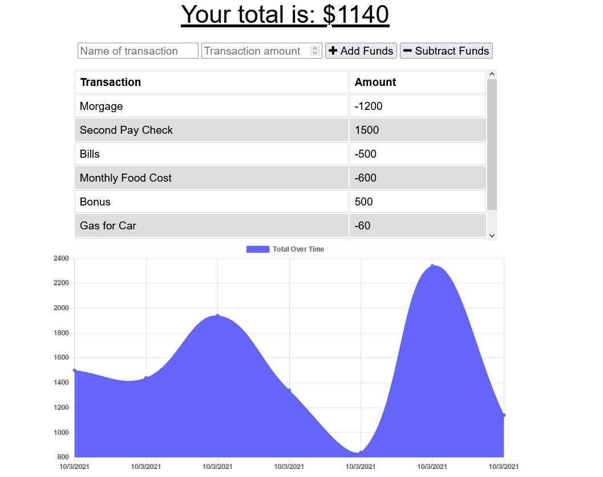

# Budget-Tracker

<!-- TABLE OF CONTENTS -->
<details open="open">
  <summary>Table of Contents</summary>
  <ol>
    <li>
      <a href="#about-the-project">About The Project</a>
      <ul>
        <li><a href="#user-story">User Story</a></li>
      </ul>
    </li>
    <li>
      <a href="#links">Links</a>
    <li><a href="#screenshot">Screenshots</a></li>
  </ol>
</details>

## About The Project

Budget Tracker is a Progressive Web Application(PWA) where a user can add expenses and funds to track with and without an internet connection. When entering transactions offline, they should populate the total when brought back online. If a user(traveler) wants to track their expenses overseas without a data/internet connection, then Budget Tracker should accurately show all of their transactions.

## User Story

```
AS AN avid traveller
I WANT to be able to track my withdrawals and deposits with or without a data/internet connection
SO THAT my account balance is accurate when I am traveling
```

## Links

- [Website](https://kevin-budget-tracker.herokuapp.com/)
- [Github Repo](https://github.com/KimShiHyun/Budget-Tracker)

## Screenshot

The following image shows the web application's appearance and functionality:


